# RePath

RePath helps users understand why an application was rejected or delayed, what to fix, and what to do next.

## Tech Stack

- Frontend: React, Vite, TypeScript, Tailwind CSS
- Backend: Python, FastAPI, Google ADK, Gemini
- Services: Firebase Authentication, Firestore, Google Cloud

## Prerequisites

- Node.js and npm
- Python 3.13+
- Firebase project with Google sign-in and Firestore enabled
- Gemini API access for the real backend flow

## Local Setup

### Backend

```powershell
cd server
python -m venv .venv
.venv\Scripts\activate
pip install -r requirements.txt
```

Create `server/.env` using `server/.env.example`, then run:

```powershell
uvicorn main:app --reload
```

Backend URL: `http://127.0.0.1:8000`

### Frontend

In another terminal:

```powershell
cd client
npm install
```

Create `client/.env` using `client/.env.example`, then run:

```powershell
npm run dev
```

Frontend URL: `http://localhost:5173`

## Basic Flow

1. Sign in with Google.
2. Open an existing recovery or start a new one.
3. Review the application issues and recovery steps.
4. Upload or replace the required documents.
5. Run the RePath readiness check before resubmission.

## Demo Screenshots

### Landing Page

The landing page introduces RePath and provides the Google sign-in entry point.

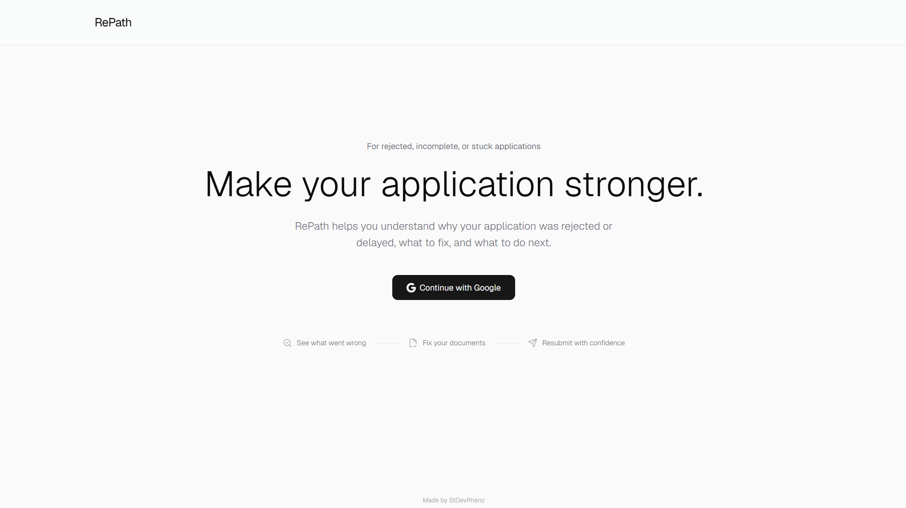

### Recoveries Page

The recoveries page is the home screen where users continue an existing application or start a new recovery.

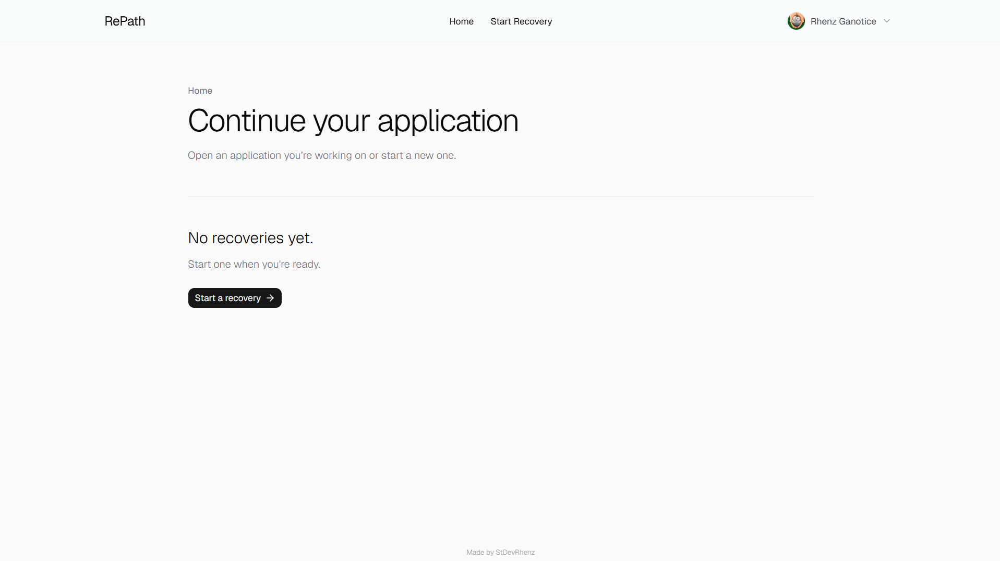

### New Recovery Form

The new recovery form lets users describe what happened to their application.

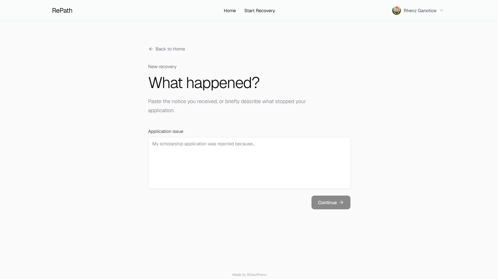

### Filled Demo Input

The filled demo input shows the realistic returned-business-registration case used by the portfolio flow.

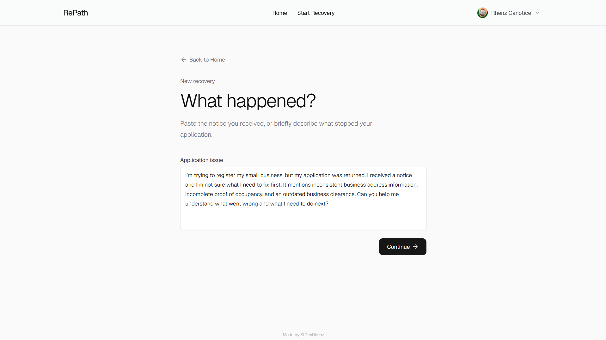

### Alternate Filled Demo Input

This alternate screenshot shows the same business-registration notice ready for local demo analysis.

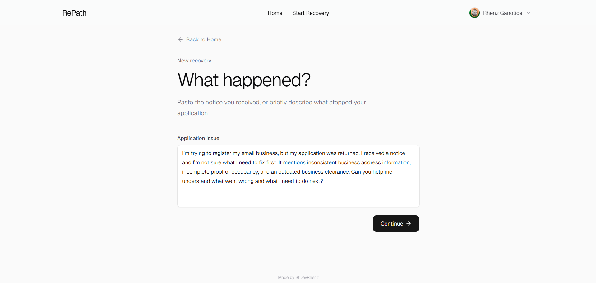

### Analysis Result

The analysis screen explains the three detected issues and lists the next actions in order.

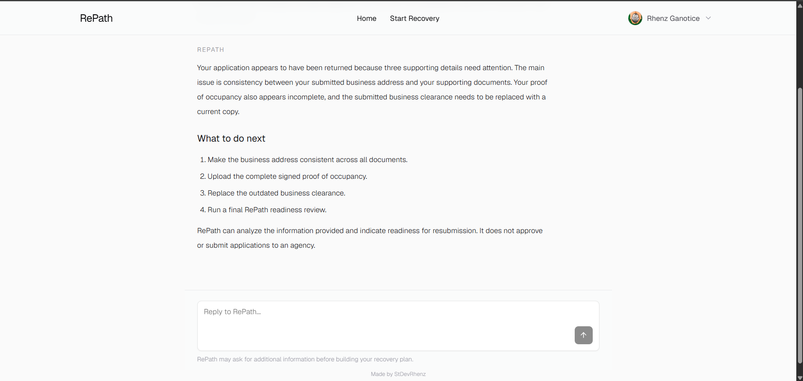

### Populated Recoveries Page

The populated recoveries page shows the RG Brew Corner case with its current action-required status.

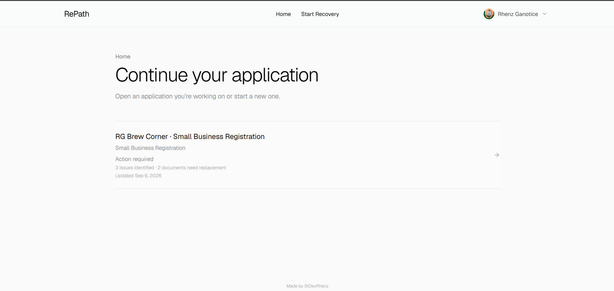

### Case Overview

The case overview summarizes progress, outstanding issues, and the next document action.

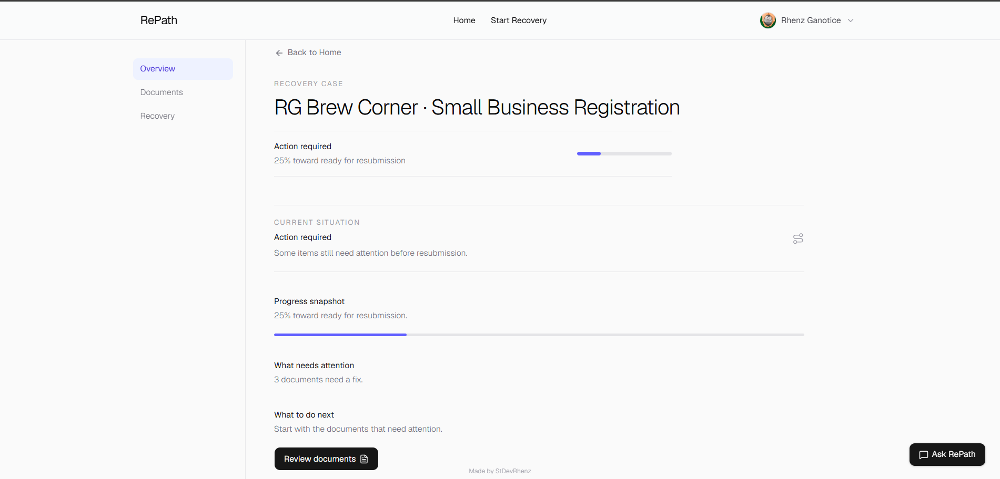

### Documents Workspace

The documents workspace lists each file, its current status, and the available replacement actions.

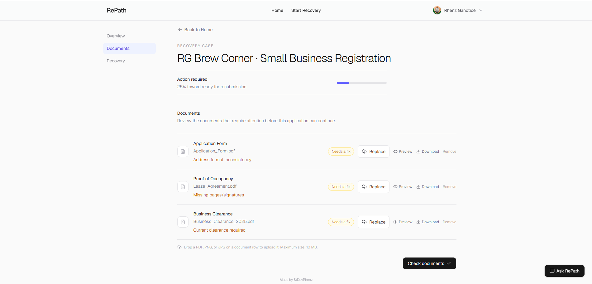

### Recovery Plan

The recovery plan presents the ordered steps from fixing the address through the final readiness review.

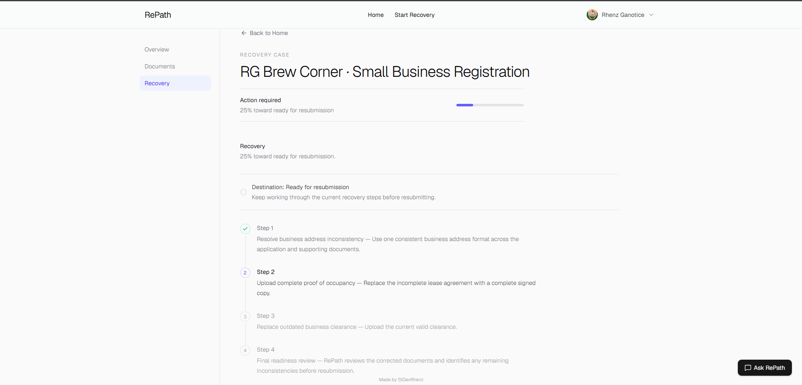

### Ask RePath Panel

The Ask RePath panel provides case-specific guidance without claiming agency approval or acceptance.

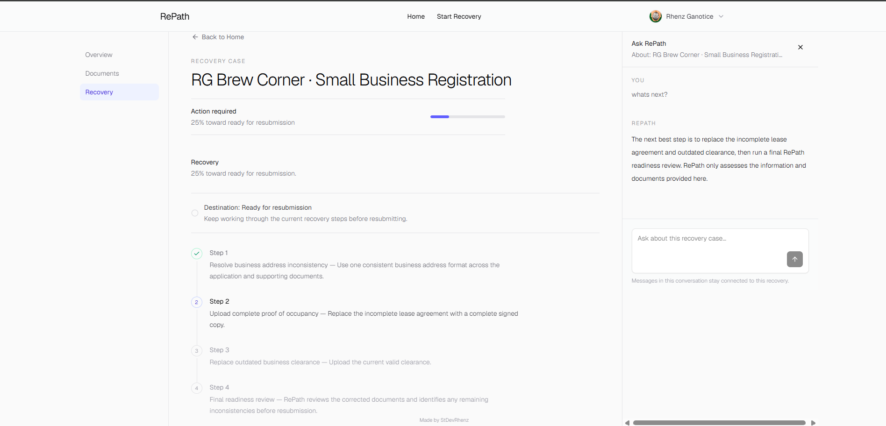

### Account Menu

The account menu gives the signed-in user access to account actions and sign-out.

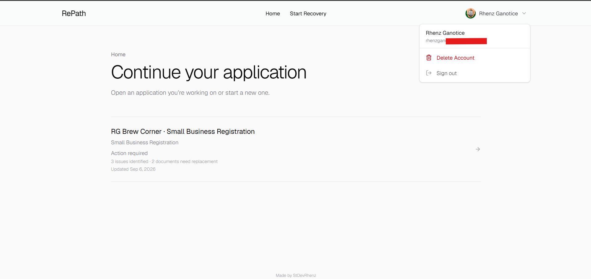

### Delete Account Dialog

The delete account dialog asks the user to confirm the destructive account action.

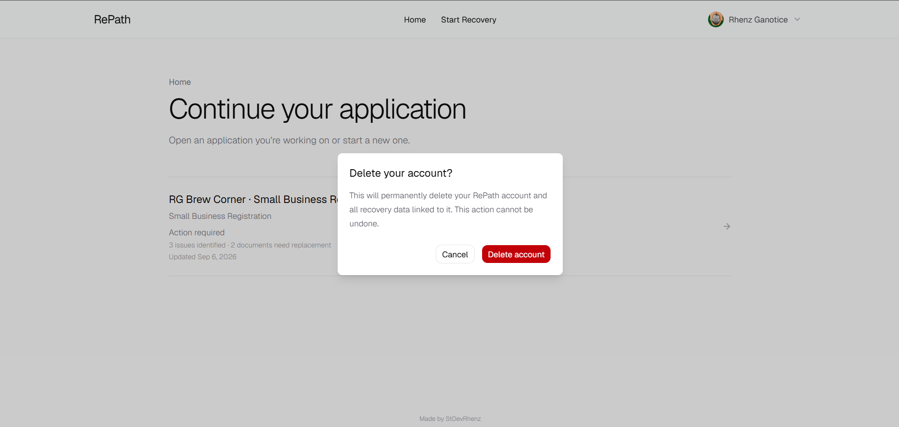

### Sign-Out Dialog

The sign-out dialog confirms whether the user wants to leave the current RePath session.

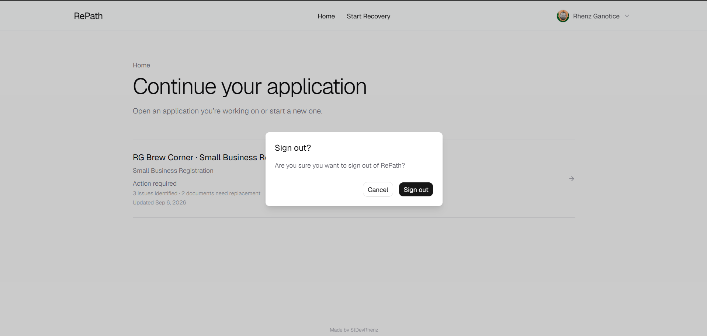

### Alternate Landing Page

This alternate landing screenshot shows the same clean RePath entry experience with the Google sign-in action.

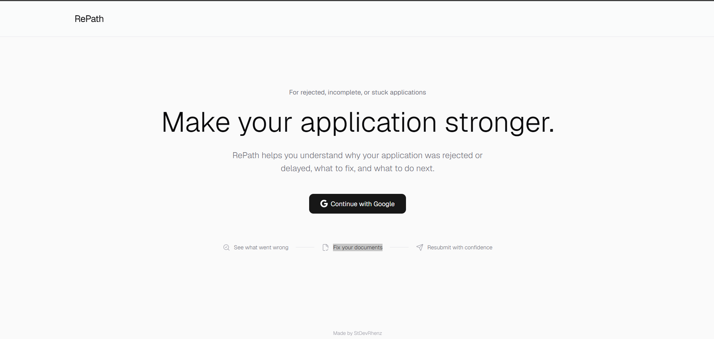

### Alternate Recoveries Page

This alternate recoveries screenshot shows the empty state before a user has created or loaded a recovery.

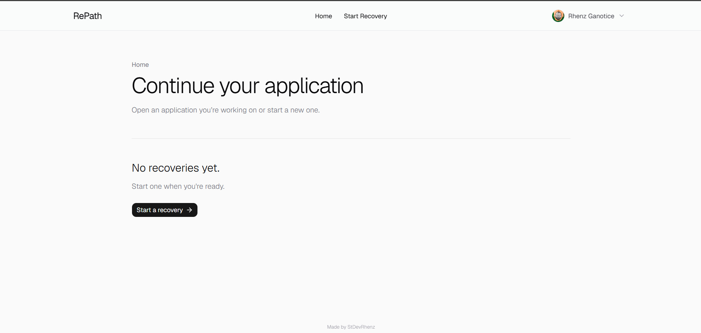


## Disclaimer
RePath only analyzes the information and documents provided by the user and indicates readiness for resubmission; it does not approve, verify, accept, or submit applications to government agencies.
